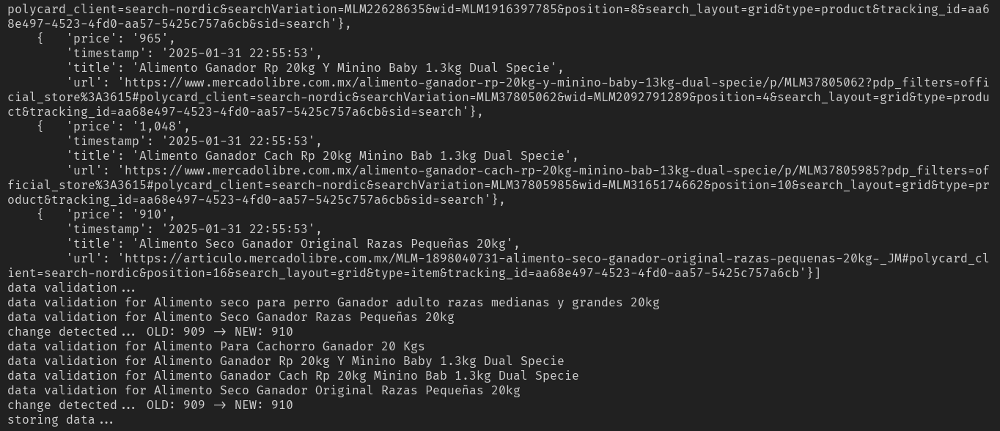
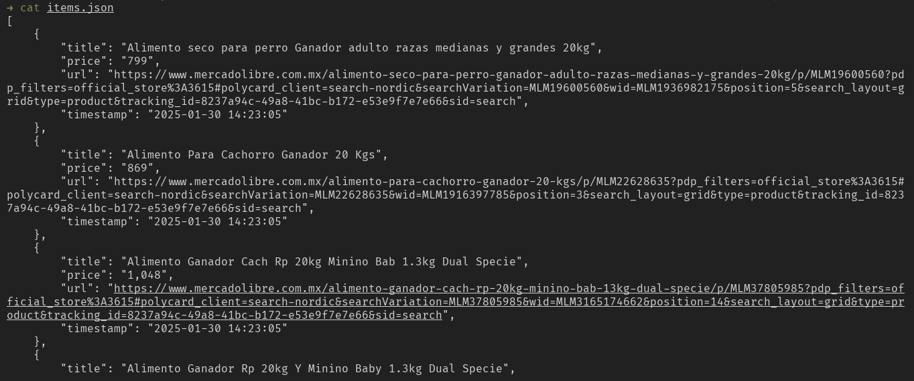
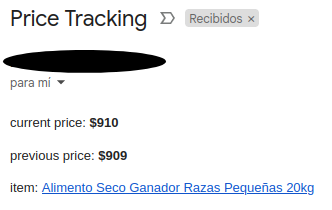

# PyTracking

Mi propia solucion local de seguimiento de precios.

Envia correo cuando detecta un cambio en el precio de mercadolibre.com, extrae los datos usando selenium y almacena los datos en un archivo json.

## Uso

Clone este repositorio, cree el entorno virtual e instale las dependencias.

```
git clone https://github.com/noe1sanji/pytracking.git
cd pytracking
python -m venv venv
source venv/bin/activate
pip install -r requirements.txt
```

Para ver las opciones.

```
python main.py --help
```

Para enviar correos especifique las variables en el archivo .env.
> Use una contraseña de aplicacion para [gmail.com](https://support.google.com/mail/answer/185833?hl=es-419)

```
GMAIL_USERNAME=""
GMAIL_PASSWORD=""
```

## Ejemplo

```
python main.py \
  --url "https://listado.mercadolibre.com.mx/animales-mascotas/_Tienda_ganador" \
  --keyword "20" \
  --cache . \
  --notify "example@gmail.com" \
  --exclude "premium"
```






