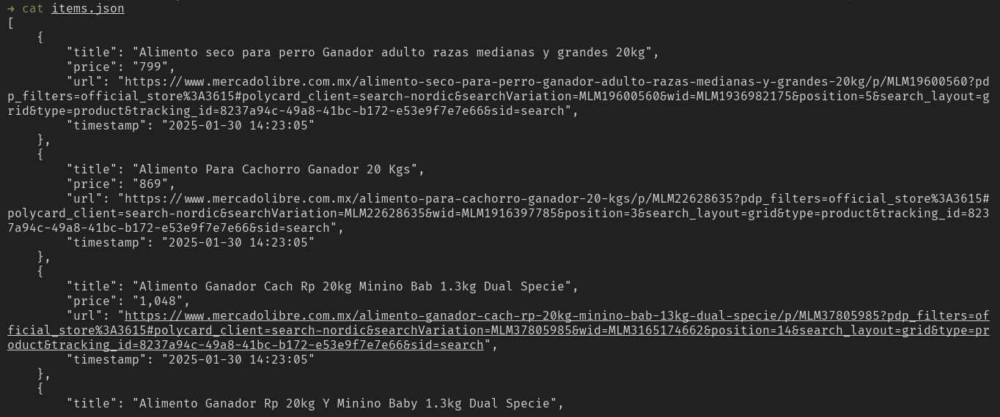

# PyTracking

My own local price tracking solution.

Sends email when it detects a change in the price of mercadolibre.com, extracts the data using Selenium or Beautiful Soup and stores the data in a json file.

## How to use

Clone this repository, create the virtual environment and install the dependencies.

```
git clone https://github.com/noe1sanji/pytracking.git
cd pytracking
python -m venv venv
source venv/bin/activate
pip install -r requirements.txt
```

To see the options.

```
python main.py --help
```

To send emails specify variables in the .env file.
> Use an app password for [gmail.com](https://support.google.com/mail/answer/185833?hl=es-419)

```
GMAIL_USERNAME=""
GMAIL_PASSWORD=""
```

## Example

```
python main.py \
  --url "https://listado.mercadolibre.com.mx/animales-mascotas/_Tienda_ganador" \
  --keyword "20" \
  --cache . \
  --notify "example@gmail.com" \
  --exclude "premium"
```





